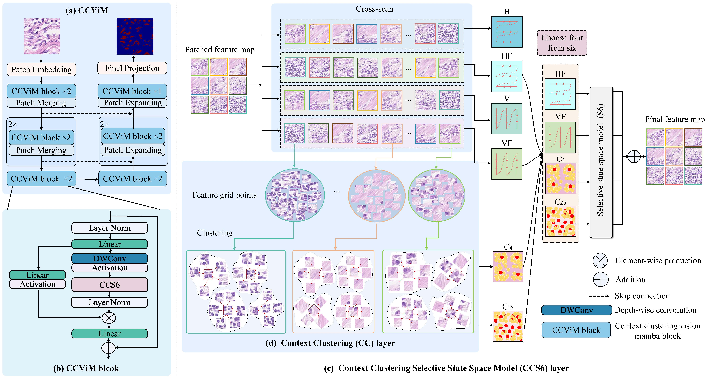
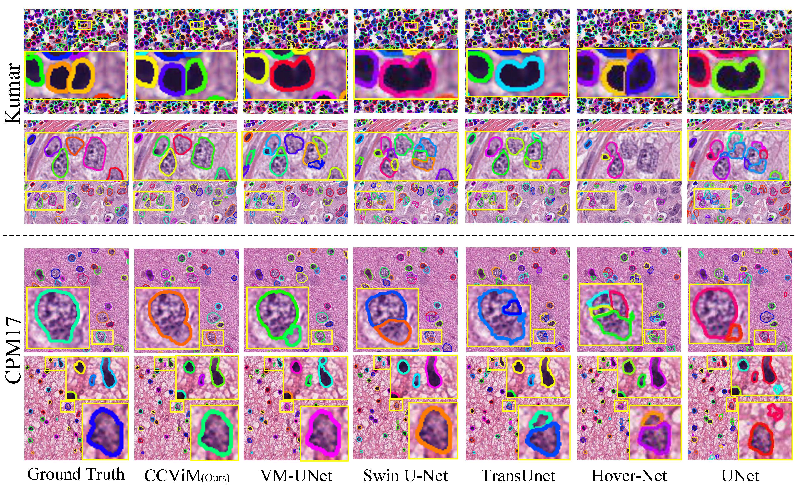
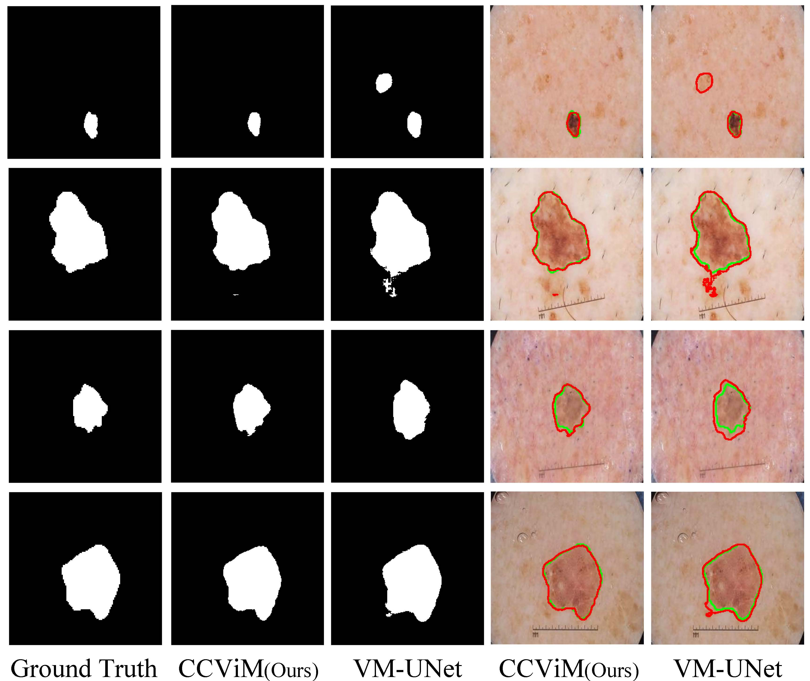
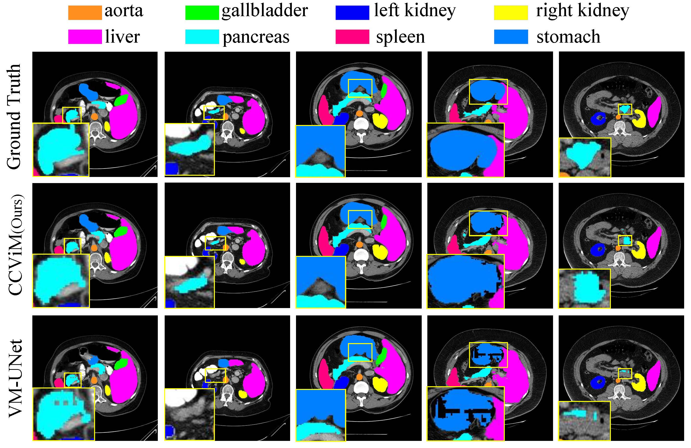

# CCViM

This repository contains the official PyTorch implementation of the following paper:

#### Merging Context Clustering with Visual State Space Models for Medical Image Segmentation

Yun Zhu,  Dong Zhang, Yi Lin, Yifei Feng and Jinhui Tang  
Computer Science and Engineering, Nanjing University of Science and Technology   

## Abstract
Medical image segmentation demands the aggregation of global and local feature representations, posing a challenge for current methodologies in handling both long-range and short-range feature interactions. Recently, vision mamba (ViM) models have emerged as promising solutions for addressing model complexities by excelling in long-range feature iterations with linear complexity. However, existing ViM approaches overlook the importance of preserving short-range local dependencies by directly flattening spatial tokens and are constrained by fixed scanning patterns that limit the capture of dynamic spatial context information. To address these challenges, we introduce a simple yet effective method named context clustering ViM (CCViM), which incorporates a context clustering module within the existing ViM models to segment image tokens into distinct windows for adaptable local clustering. Our method effectively combines long-range and short-range feature interactions, thereby enhancing spatial contextual representations for medical image segmentation tasks. Extensive experimental evaluations on diverse public datasets, \ie, Kumar, CPM17, ISIC17, ISIC18, and Synapse, demonstrate the superior performance of our method compared to current state-of-the-art methods.


## The overall architecture


## Visual results on Nuclei dataset


## Visual results on ISIC17 dataset


## Visual results on Synapse dataset


## 0. Main Environments
```bash
conda create -n CCViM python=3. 
conda activate CCViM
pip install torch==1.13.0 torchvision==0.14.0 torchaudio==0.13.0 --extra-index-url https://download.pytorch.org/whl/cu117
pip install packaging
pip install timm==0.4.12
pip install pytest chardet yacs termcolor
pip install submitit tensorboardX
pip install triton==2.0.0
pip install causal_conv1d==1.0.0  # causal_conv1d-1.0.0+cu118torch1.13cxx11abiFALSE-cp38-cp38-linux_x86_64.whl
pip install mamba_ssm==1.0.1  # mmamba_ssm-1.0.1+cu118torch1.13cxx11abiFALSE-cp38-cp38-linux_x86_64.whl
pip install scikit-learn matplotlib thop h5py SimpleITK scikit-image medpy yacs
```
The version of causal_conv1d can be found here. {[causal_conv1d](https://github.com/Dao-AILab/causal-conv1d/releases)} 
The version of mamba_ssm can be found here. {[mamba_ssm](https://github.com/state-spaces/mamba/releases/)}

## 1. Prepare the dataset

### ISIC datasets
- The ISIC17  divided into a 7:3 ratio, can be found here {[GoogleDrive](https://drive.google.com/file/d/1ZTOVI5Vp3KTQFDt5moJThJ_xYp2pKBAK/view?usp=sharing)}.
- The ISIC18  divided into a 7:3 ratio, can be found here {[GoogleDrive](https://drive.google.com/file/d/1AOpPgSEAfgUS2w4rCGaJBbNYbRh3Z_FQ/view?usp=sharing)}.
- After downloading the datasets, you are supposed to put them into './data/isic17/' and './data/isic18/', and the file format reference is as follows. (take the ISIC17 dataset as an example.)

- './data/isic17/'
  - train
    - images
      - .png
    - masks
      - .png
  - val
    - images
      - .png
    - masks
      - .png

### Synapse datasets

- For the Synapse dataset, can be found here {[GoogleDrive](https://drive.google.com/file/d/1-eDXzTgXrTTo7hcrWZnh_wVEtB92PBNz/view?usp=sharing)}.

- After downloading the datasets, you are supposed to put them into './data/Synapse/', and the file format reference is as follows.

- './data/Synapse/'
  - lists
    - list_Synapse
      - all.lst
      - test_vol.txt
      - train.txt
  - test_vol_h5
    - casexxxx.npy.h5
  - train_npz
    - casexxxx_slicexxx.npz

### CPM17 dataset 
- For the CPM17 dataset, can be found here {[GoogleDrive](https://drive.google.com/file/d/1k7JmMqDsEmd1KqpnPmHh8kK_38oJDTh2/view?usp=sharing)}.
- After downloading the datasets, you are supposed to put them into '/data/cpm17/', and the file format reference is as follows.
  -  './data/cpm17/processed/cpm17/'
  - tran
    - .npy
  - valid
    - .npy
- If you want to process by yourself, you can run file in 'CCViM-nuclei/patch_extract/extract_patches_cpm17.py'
  -  './data/cpm17/'
  - tran
    - Images
    - Labels
    - Overlay
  - test
    - Images
    - Labels
    - Overlay
 
### Kumar dataset 
- For the Kumar dataset, can be found here {[GoogleDrive]( )}.
- After downloading the datasets, you are supposed to put them into '/data/kumar/', and the file format reference is as follows.
  -  './data/kumar/processed/kumar/'
  - tran
    - .npy
  - valid
    - .npy
- If you want to process by yourself, you can run file in 'CCViM-nuclei/patch_extract/extract_patches_kumar.py'
  -  './data/kumar/'
  - tran
    - Images
    - Labels
    - Overlay
  - test
    - Images
    - Labels
    - Overlay

## 2. Prepare the pre_trained weights

| Tasks     |     weights |
|:----------|------------:|
| CPM17     | [weight]() | 
| Kumar     | [weight]() |
| ISIC17    | [weight](https://drive.google.com/file/d/1e16OoWkeTOgAPv6ayv9vn4d-uHfl371Z/view?usp=sharing) | 
| ISIC18    | [weight](https://drive.google.com/file/d/1R20ea_rZmkjjAgOe0husqieCSq49hX6o/view?usp=sharing) | 
| Synapse   | [weight](https://drive.google.com/file/d/1wsGpz4QsMHtWd33Zm3XgKMRjVTG9U3DL/view?usp=sharing) |
The pretrain weight of LocalMamba can be found at [LocalMamba](https://drive.google.com/file/d/1CWP5atOLJYnoBr8Nx8159WJMNeSUe2ei/view?usp=sharing)

## 3. Train and Infer on the CCViM 

### ISIC17, ISIC18, and Synapse tasks
```bash
cd CCViM
train: train_isic17.py, train_isic18.py, train_synapse.py  
infer: infer_isic17.py, infer_isic18.py, infer_synapse.py  
```


### CPM17 tasks
```bash
cd CCViM_nuclei/CPM17
train: CCViM_nuclei/kumar/train.py
infer: CCViM_nuclei/kumar/test.py  
metirc: CCViM_nuclei/kumar/compute_state.py 
```
- After training, you could obtain the results in './CPM17/output/'
- After inferring, you could obtain the results in './CPM17/infer_output/'

### Kumar tasks
```bash
cd CCViM_nuclei/kumar
train: CCViM_nuclei/kumar/train.py
infer: CCViM_nuclei/kumar/test.py  
metirc: CCViM_nuclei/kumar/compute_state.py 
```
- After training, you could obtain the results in './kumar/output/'
- After inferring, you could obtain the results in './kumar/infer_output/'


## 4. Acknowledgments

- We thank the authors of [VMUNet](https://github.com/JCruan519/VM-UNet), [LocalMamba](https://github.com/hunto/LocalMamba) and [CoCs](https://github.com/ma-xu/Context-Cluster) for their open-source codes.
